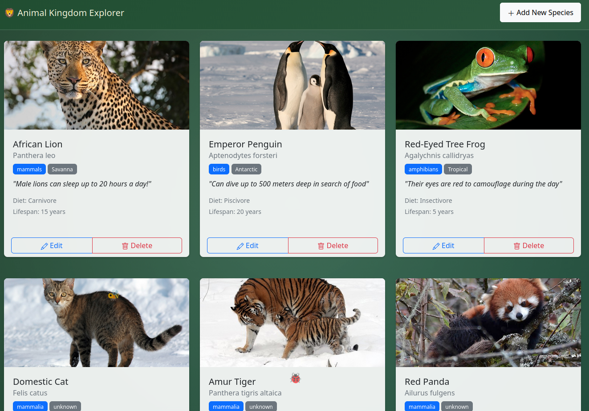
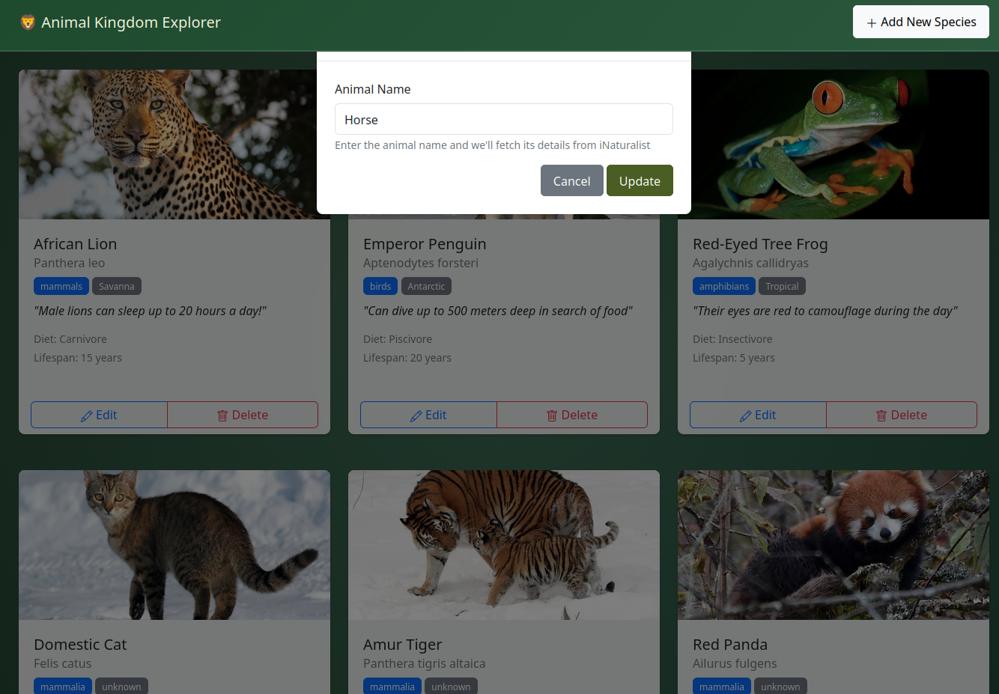
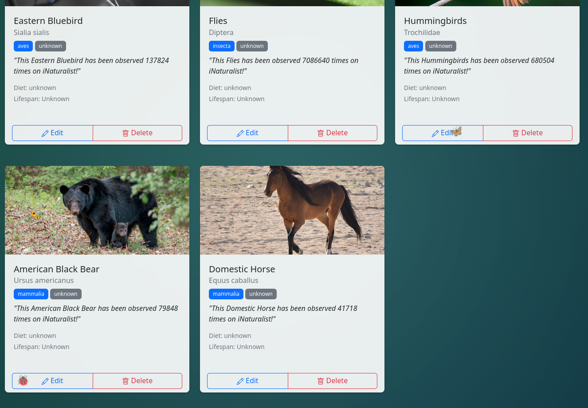

# 🐾 Species Encyclopedia

A full-stack web application that allows users to search for animals and instantly retrieve their scientific names, images, and fascinating facts. The project integrates with the **iNaturalist API** to provide accurate, real-time biological data.

## 📸 Media

### Dashboard & Search

*Figure 1: The main dashboard showcasing the species collection.*


*Figure 2: Using the search modal to add a new species (e.g., "horse").*


*Figure 3: The dashboard after successfully adding new animals.*

### Demonstration Video
 [](docs/media/Animal_Kingdom_Explorer_Video.mp4)
 *Click the image above to watch the demonstration video.*

## ✨ Features

- **Species Search**: Enter the name of any animal (e.g., "Lion", "Fish", "Penguin") to fetch its details.
- **Real-time Data**: Automatically retrieves scientific names, common names, and high-quality images from the iNaturalist database.
- **Local Encyclopedia**: Saves searched species to a local database for quick reference.
- **Manage Entries**: Edit or delete animal entries to customize your personal encyclopedia.
- **Dynamic UI**: Responsive design built with Bootstrap, featuring animal cards with detailed information like diet, habitat, and fun facts.

## 🛠️ Tech Stack

- **Frontend**: HTML5, CSS3, JavaScript (ES6+), Bootstrap 5
- **Backend**: Node.js, Express.js
- **Database**: SQLite3
- **API**: [iNaturalist API](https://api.inaturalist.org/v1/docs/)

## 🚀 Getting Started

### Prerequisites

- [Node.js](https://nodejs.org/) (v14 or higher)
- npm (Node Package Manager)

### Installation & Setup

1. **Clone the repository**:
   ```bash
   git clone https://github.com/AlbinKlintman/gik339-37-projekt.git
   cd gik339-37-projekt
   ```

2. **Setup the Server**:
   ```bash
   cd server
   npm install
   npm start
   ```
   The server will run on `http://localhost:3000`.

3. **Setup the Client**:
   In a new terminal:
   ```bash
   cd client
   npm install
   npx serve
   ```
   *Note: If port 3000 is in use, `serve` will automatically pick another port (e.g., 42491).*

4. **Access the App**:
   Open the URL provided by `serve` in your browser.

## 📖 How It Works

1. The user enters an animal name in the "Search & Add" form.
2. The server receives the request and queries the **iNaturalist API** for an exact match or autocomplete suggestions.
3. If found, the server fetches the species' scientific name, a medium-sized image URL, and observation statistics.
4. This data is then stored in the local `animals.db` (SQLite) and sent back to the client to be displayed in a beautiful Bootstrap card.

---
*Created as part of the GIK339 course at the University of Skövde.*
